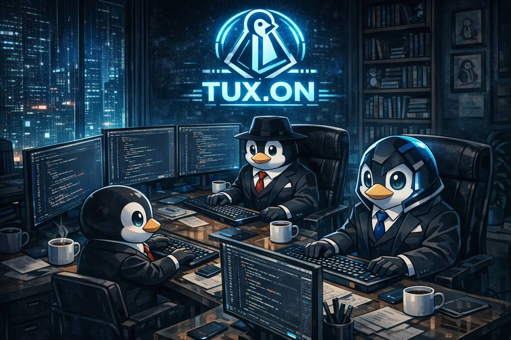

  
  

<h1>Tux.on Devs</h1>

Equipe de desenvolvimento focada em soluções <strong>Linux-first</strong>, automações com IA e ferramentas para devs.  
Construindo projetos abertos, opinativos e voltados para produtividade em ambientes Linux.

 

---

## Português

Bem-vindo à **Tux.on Devs**!  
Somos um time apaixonado por Linux, desenvolvimento backend/frontend e automação de infraestrutura.

- 🐧 Foco: ferramentas para devs, automações e plataformas cloud-native  
- 🧠 Tecnologias: Linux, Docker, Kubernetes, Python, Node.js, Java, C#  
- 🤝 Objetivo: criar projetos open source que melhorem o dia a dia de quem vive no terminal  

## English

Welcome to **Tux.on Devs**!  
We are a team focused on Linux-first development, infrastruc
